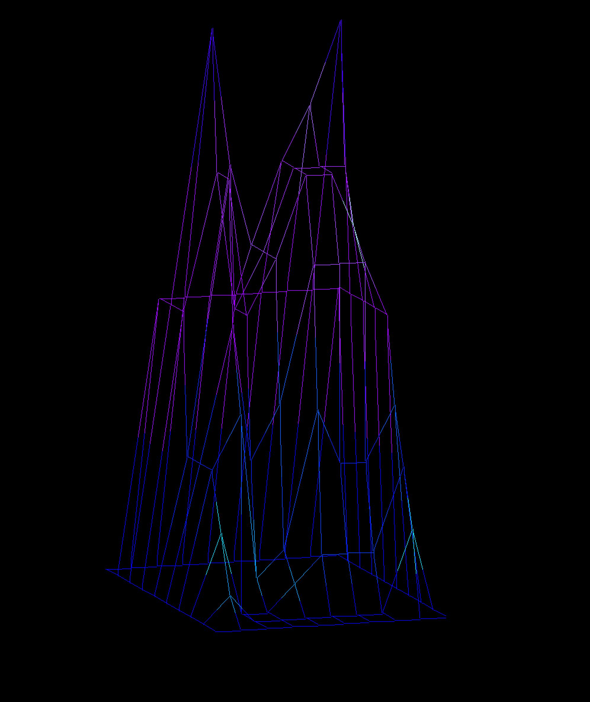
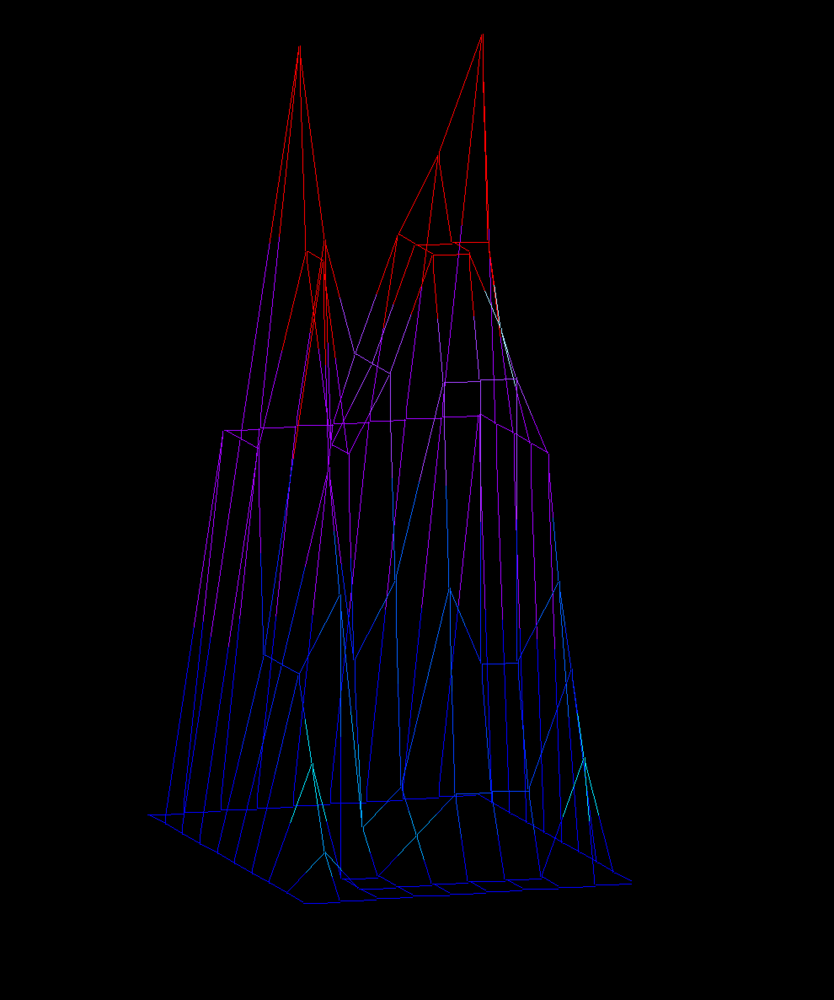

# FDF

Generates interactive wire frame models from input files.

## Input:
Input files consist of a grid of space delimited integers. The numbers position in the grid corresponds to its x and y coordinate, and the value of the number corresponds with its z coordinate. Each node can also be designated a specific color by following the number with a comma and a rgba color value. If color is not specified then it is determined by the z value of the node.

### Examples:
#### Input and output without color:
* Input: elem.fdf
```
0  0  0  0  0  0  0  0  0  0
0 10 10 10 10 10 10 10 10  0
0 10 20 15 12 15 17 20 10  0
0 10 15 10 12 15 15 15 10  0
0  5 15 10 12 15 15 13 10  0
0  5 10  5  7 12 12 12 10  0
0  5  7  1  2  7  5  5  7  0
0  3  0  0  1  2  2  2  5  0
0  1  0  0  0  0  0  0  3  0
0  0  0  0  0  0  0  0  0  0
```
* Ouput:



#### Input and output with color:
* Input: elem-col.fdf
```
0  0  0  0  0  0  0  0  0  0
0 10 10 10 10 10 10 10 10  0
0 10 20,0xFF0000 15,0xFF0000 12 15,0xFF0000 17,0xFF0000 20,0xFF0000 10  0
0 10 15,0xFF0000 10 12 15,0xFF0000 15,0xFF0000 15,0xFF0000 10  0
0  5 15,0xFF0000 10 12 15,0xFF0000 15,0xFF0000 13 10  0
0  5 10  5  7 12 12 12 10  0
0  5  7  1  2  7  5  5  7  0
0  3  0  0  1  2  2  2  5  0
0  1  0  0  0  0  0  0  3  0
0  0  0  0  0  0  0  0  0  0
```

* Output:


## Usage:
```
make
./fdf <filename> [window width] [window length]
```
Window width and window length are optional parameters.

### Controls:
| Key | Description |
|:-----:|-------------|
|esc|quit program|
|q|	rotate image direction: +1.4 degrees axis: x
|e|	rotate image direction:-1.4 degrees axis: x
|w|	rotate image direction:+1.4 degrees axis: y
|s|	rotate image direction:-1.4 degrees axis: y
|d|	rotate image direction:+1.4 degrees axis: z
|a|	rotate image direction:-1.4 degrees axis: z
|7|	rotate image direction:+90 degrees axis: x
|9|	rotate image direction:-90 degrees axis: x
|8|	rotate image direction:+90 degrees axis: y
|5|	rotate image direction:-90 degrees axis: y
|4|	rotate image direction:+90 degrees axis: z
|6|	rotate image direction:-90 degrees axis: z
|1|	invert x rotation
|2|	invert y rotation
|3|	invert z rotation
|0|	birds eyes view (rotation on all axis are 0)
|space| isometric view
|←|	shift image direction:left
|→|	shift image direction:right
|↑|	shift image direction:up
|↓|	shift image direction:down
|+|	zoom in
|-|	zoom out
|lshift| cycle colors
|rshift| back cycle colors
